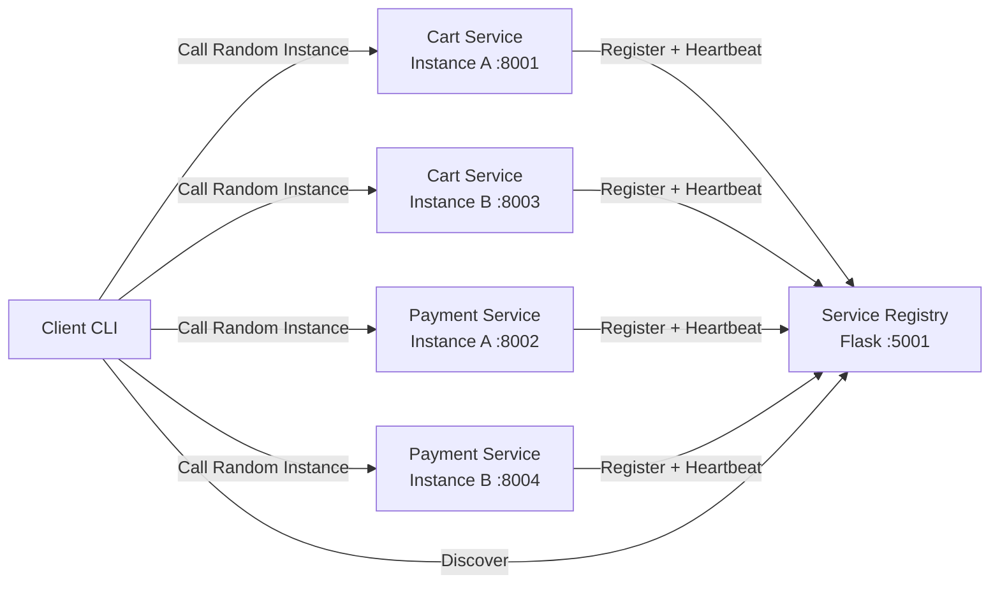

# Service Registry - Distributed System Learning Project

A simple but functional service registry implementation for understanding service discovery in distributed systems.

## 📚 What is a Service Registry?

A **Service Registry** is a database of available service instances in a distributed system. It enables:

- **Service Registration**: Services register themselves when they start
- **Service Discovery**: Services can find and communicate with each other
- **Health Monitoring**: Track which services are alive and healthy
- **Load Balancing**: Distribute requests across multiple service instances

## 🏗️ Architecture

For more architecture diagrams and deeper explanations, see [ARCHITECTURE.md](ARCHITECTURE.md).

### Architecture Diagram (Client + Services)



## 🧯 Failure Scenarios Covered

- Registry unavailable: services retry registration and heartbeats with exponential backoff, jitter, and a max retry cap.
- Stale instances: registry cleans up instances without recent heartbeats.
- Client-side failures: client retries discovery and fails over to another instance if a call fails.
- Retry-safe payments: optional `Idempotency-Key` prevents duplicate charges during retries.
- Kubernetes health checks: readiness probes remove unhealthy pods from service endpoints; liveness probes restart stuck containers.

### Legacy ASCII Diagram (Registry Overview)

```text
┌─────────────┐         ┌─────────────────┐         ┌─────────────┐
│  Service A  │────────▶│ Service Registry │◀────────│  Service B  │
│ (Port 8001) │ Register│   (Port 5001)    │ Discover│ (Port 8002) │
└─────────────┘         └─────────────────┘         └─────────────┘
      │                          │                          │
      └──────── Heartbeat ───────┘                          │
                                 └──────── Heartbeat ───────┘
```

## 📁 Project Files

### 1. `service_registry.py` (Original Example)
The basic implementation you provided - simple but functional.

**Pros:**
- ✅ Simple and easy to understand
- ✅ Core functionality works

**Cons:**
- ❌ No error handling
- ❌ No health checks
- ❌ No way to remove services
- ❌ Services stay registered forever (even if they crash)

### 2. `service_registry_improved.py` (Production-Ready)
Enhanced version with enterprise features.

**New Features:**
- ✅ **Error Handling**: Proper validation and error responses
- ✅ **Health Checks**: Heartbeat mechanism to detect dead services
- ✅ **Deregistration**: Services can unregister gracefully
- ✅ **Auto Cleanup**: Removes stale services automatically
- ✅ **Thread Safety**: Uses locks for concurrent access
- ✅ **Detailed Responses**: Rich JSON responses with metadata
- ✅ **Service Listing**: View all registered services

### 3. Real Services + Client
- `cart_service.py` - Add-to-cart API with in-memory cart storage
- `payment_service.py` - Payment API with mock charge + status endpoints
- `client.py` - Discovers a service and calls a random instance

### 4. Kubernetes/Minikube Deployment
- **Dockerfile** - Container image for the registry
- **k8s/** - Kubernetes manifests for deployment
- **KUBERNETES.md** - Complete Kubernetes deployment guide
- **deploy-minikube.sh** - Automated deployment script

### 5. HashiCorp Consul Integration
- **consul_client.py** - Consul service discovery client
- **CONSUL.md** - Production-grade service registry guide
- Compare custom implementation with industry-standard Consul

## 🚀 Getting Started

Choose your learning path:

### Option 1: Local Development (Recommended for Learning)

#### Prerequisites

Python 3.8 or higher

#### Installation

1. **Clone the repository:**
```bash
git clone https://github.com/ranjanr/ServiceRegistry.git
cd ServiceRegistry
```

2. **Create a virtual environment:**
```bash
python3 -m venv venv
source venv/bin/activate  # On Windows: venv\Scripts\activate
```

3. **Install dependencies:**
```bash
pip install -r requirements.txt
```

#### Running the Registry

**Basic Version:**
```bash
python3 service_registry.py
```

**Improved Version (Recommended):**
```bash
python3 service_registry_improved.py
```

The registry will start on `http://localhost:5001`

#### Running Real Services (2 instances each)

Terminal 1:
```bash
python3 cart_service.py --port 8001
```

Terminal 2:
```bash
python3 cart_service.py --port 8003
```

Terminal 3:
```bash
python3 payment_service.py --port 8002
```

Terminal 4:
```bash
python3 payment_service.py --port 8004
```

#### Client Discovery + Random Instance Call

```bash
# Add to cart via a random cart-service instance
python3 client.py cart-service /cart/add --method POST --json '{"user_id":"u1","item_id":"sku-1","quantity":2}'

# Fetch cart from a random cart-service instance
python3 client.py cart-service /cart/u1

# Charge payment via a random payment-service instance
python3 client.py payment-service /payment/charge --method POST --json '{"user_id":"u1","amount":19.99,"method":"card"}' --idempotency-key "charge-u1-1"
```

### ✅ Verification Checklist (Assignment Requirements)

Use the steps below to verify each requirement end-to-end on your machine.

#### 1) Run the Registry

```bash
python3 service_registry_improved.py
```

Expected logs:
```
Service Registry starting on port 5001...
Heartbeat timeout: 30s
Cleanup interval: 10s
```

If you see **"Address already in use"**, stop the process using port 5001:
```bash
lsof -i :5001
kill <PID>
```

#### 2) Run 2 Service Instances (Cart + Payment)

Cart service:
```bash
python3 cart_service.py --port 8001
python3 cart_service.py --port 8003
```

Payment service:
```bash
python3 payment_service.py --port 8002
python3 payment_service.py --port 8004
```

#### 3) Verify Registration with the Registry

```bash
curl http://localhost:5001/discover/cart-service
curl http://localhost:5001/discover/payment-service
```

Expected: each response shows **2 instances** in `instances`.

#### 4) Client Discovers Service

The client uses the registry to discover instances automatically:
```bash
python3 client.py cart-service /cart/u1
```

#### 5) Client Calls a Random Instance

```bash
python3 client.py cart-service /cart/add --method POST --json '{"user_id":"u1","item_id":"sku-1","quantity":2}'
python3 client.py payment-service /payment/charge --method POST --json '{"user_id":"u1","amount":19.99,"method":"card"}' --idempotency-key "charge-u1-1"
```

Expected output includes the **instance URL** called, e.g.:
```
Called http://localhost:8001/cart/add -> 200
```

## 📦 Deliverables

- GitHub repo (this project)
- Architecture diagram (Mermaid in this README and in `ARCHITECTURE.md`)

### Option 2: Kubernetes/Minikube (Production-like Environment)

#### Prerequisites

- [Minikube](https://minikube.sigs.k8s.io/docs/start/)
- [kubectl](https://kubernetes.io/docs/tasks/tools/)
- Docker

#### Quick Deploy

```bash
# One-command deployment
./deploy-minikube.sh
```

This will:
1. Start Minikube (if not running)
2. Build Docker image
3. Deploy registry and example services
4. Show access URLs and test commands

#### Manual Deploy

```bash
# Start Minikube
minikube start

# Build image
eval $(minikube docker-env)
docker build -t service-registry:latest .

# Deploy
kubectl apply -f k8s/registry-deployment.yaml
kubectl apply -f k8s/example-service-deployment.yaml

# Access
minikube ip  # Get IP
curl http://<MINIKUBE_IP>:30001/health
```

**See [KUBERNETES.md](KUBERNETES.md) for complete guide.**

### Testing with Example Services

**Terminal 1: Start the Registry**
```bash
python service_registry_improved.py
```

**Terminal 2: Start User Service**
```bash
python example_service.py user-service 8001
```

**Terminal 3: Start Payment Service**
```bash
python example_service.py payment-service 8002
```

**Terminal 4: Run Discovery Demo**
```bash
python example_service.py demo
```

## 📡 API Endpoints

### 1. Register a Service
```http
POST /register
Content-Type: application/json

{
  "service": "user-service",
  "address": "http://localhost:8001"
}
```

**Response:**
```json
{
  "status": "registered",
  "message": "Service user-service registered at http://localhost:8001"
}
```

### 2. Discover a Service
```http
GET /discover/user-service
```

**Response:**
```json
{
  "service": "user-service",
  "instances": [
    {
      "address": "http://localhost:8001",
      "uptime_seconds": 45.2
    }
  ],
  "count": 1
}
```

### 3. Send Heartbeat
```http
POST /heartbeat
Content-Type: application/json

{
  "service": "user-service",
  "address": "http://localhost:8001"
}
```

### 4. Deregister a Service
```http
POST /deregister
Content-Type: application/json

{
  "service": "user-service",
  "address": "http://localhost:8001"
}
```

### 5. List All Services
```http
GET /services
```

**Response:**
```json
{
  "services": {
    "user-service": {
      "total_instances": 2,
      "active_instances": 2
    },
    "payment-service": {
      "total_instances": 1,
      "active_instances": 1
    }
  },
  "total_services": 2
}
```

### 6. Health Check
```http
GET /health
```

## 🔍 Key Concepts Explained

### 1. Service Registration
When a service starts, it tells the registry:
- **Who am I?** (service name)
- **Where am I?** (address/port)

```python
# Service registers itself
requests.post("http://registry:5001/register", json={
    "service": "user-service",
    "address": "http://localhost:8001"
})
```

### 2. Service Discovery
When a service needs to call another service:
- Ask the registry for available instances
- Get list of addresses
- Choose one (round-robin, random, etc.)

```python
# Discover payment service
response = requests.get("http://registry:5001/discover/payment-service")
instances = response.json()['instances']
payment_url = instances[0]['address']  # Use first instance
```

### 3. Heartbeat Mechanism
Services periodically send "I'm alive" signals:
- Prevents stale entries
- Detects crashed services
- Registry removes services that stop sending heartbeats

```python
# Send heartbeat every 10 seconds
while True:
    requests.post("http://registry:5001/heartbeat", json={
        "service": "user-service",
        "address": "http://localhost:8001"
    })
    time.sleep(10)
```

### 4. Graceful Shutdown
When a service stops, it should deregister:
- Prevents clients from calling dead services
- Keeps registry clean

```python
# On shutdown
requests.post("http://registry:5001/deregister", json={
    "service": "user-service",
    "address": "http://localhost:8001"
})
```

## 🎯 Real-World Use Cases

### Netflix Eureka
Netflix uses a similar pattern with their Eureka service registry:
- Microservices register on startup
- Other services discover them dynamically
- Handles thousands of service instances

### Kubernetes Service Discovery
Kubernetes has built-in service discovery:
- Services register via DNS
- Load balancing across pods
- Health checks and auto-restart

### Consul by HashiCorp
Production-grade service registry with:
- Health checking
- Key-value store
- Multi-datacenter support

## 🔧 Improvements You Could Add

1. **Persistence**: Save registry to disk/database
2. **Load Balancing**: Return instances in round-robin order
3. **Service Metadata**: Store version, tags, capabilities
4. **Authentication**: Secure the registry endpoints
5. **Monitoring**: Add metrics and logging
6. **Clustering**: Multiple registry instances for high availability
7. **Service Mesh**: Integrate with Istio or Linkerd

## 🧪 Testing with cURL

```bash
# Register a service
curl -X POST http://localhost:5001/register \
  -H "Content-Type: application/json" \
  -d '{"service": "test-service", "address": "http://localhost:9000"}'

# Discover services
curl http://localhost:5001/discover/test-service

# List all services
curl http://localhost:5001/services

# Send heartbeat
curl -X POST http://localhost:5001/heartbeat \
  -H "Content-Type: application/json" \
  -d '{"service": "test-service", "address": "http://localhost:9000"}'

# Deregister
curl -X POST http://localhost:5001/deregister \
  -H "Content-Type: application/json" \
  -d '{"service": "test-service", "address": "http://localhost:9000"}'
```

## 📊 Comparison: Original vs Improved

| Feature | Original | Improved |
|---------|----------|----------|
| Registration | ✅ | ✅ |
| Discovery | ✅ | ✅ |
| Error Handling | ❌ | ✅ |
| Heartbeats | ❌ | ✅ |
| Deregistration | ❌ | ✅ |
| Auto Cleanup | ❌ | ✅ |
| Thread Safety | ❌ | ✅ |
| Service Listing | ❌ | ✅ |
| Health Endpoint | ❌ | ✅ |
| Uptime Tracking | ❌ | ✅ |

## 🎓 Learning Resources

- **Microservices Patterns** by Chris Richardson
- **Building Microservices** by Sam Newman
- **Martin Fowler's Blog**: https://martinfowler.com/articles/microservices.html

## 📝 License

This is a learning project - feel free to use and modify as needed!

## 🤝 Contributing

This is an educational project. Feel free to:
- Add new features
- Improve documentation
- Create additional examples
- Share your learnings!
